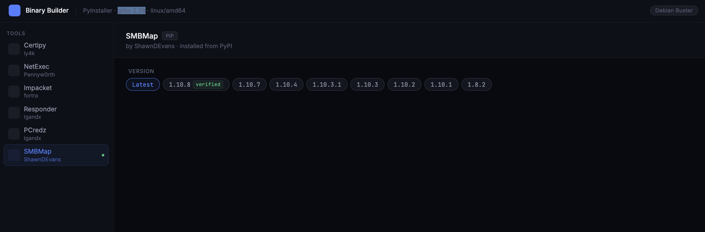
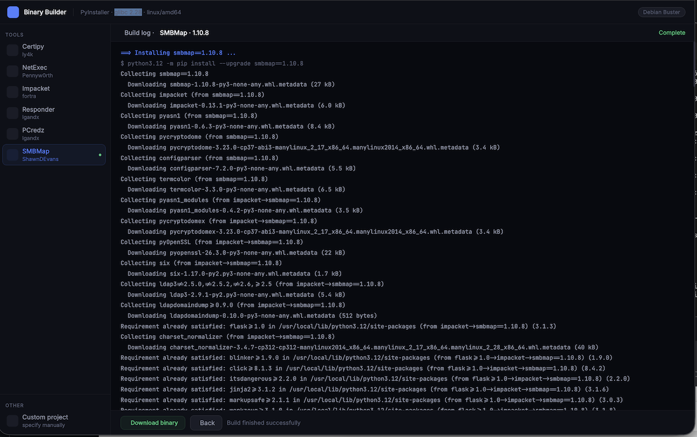

# OffensivePythonPipeline

Build standalone **Python 3** binaries for popular offensive security tools, compiled against **glibc 2.28** for improved compatibility across Linux distributions.

## Features

- Build standalone Python 3 binaries
- Compiled against **glibc 2.28**
- Docker-based build environment
- No Python installation required on the target system

## Supported Tools

- Certipy
- NetExec
- Impacket
- Responder
- PCredz
- SMBMap

## Screenshots

### Main Menu



### Building a Binary


  
## Build

```bash
docker build --platform linux/amd64 -t pybuilder .
```

## Run

```bash
docker run --rm --platform linux/amd64 -p 5001:5000 pybuilder
```

## Output

The pipeline generates standalone Python binaries that can be deployed on Linux systems with **glibc 2.28** or newer, minimizing runtime dependencies on the target host.
